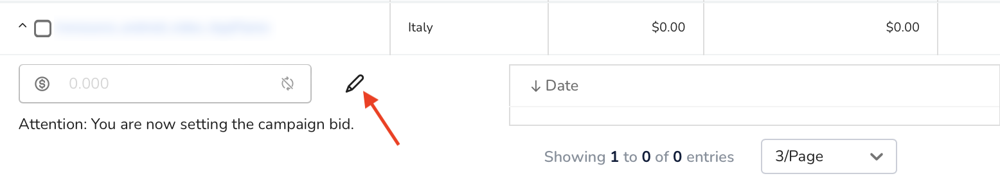

# Adjust bids manually

In justtrack, you can configure a single bid. In this guide, you'll learn how to do that in two different views:

1. Statistics
2. Campaign details

## Adjust bids from Statistics

In the _Main Menu_, click [**Advertising -> Statistics**](https://dashboard.justtrack.io/advertising/statistics):

<figure><figcaption></figcaption></figure>

Add the **Campaign** and **Country** dimensions. If you want to adjust your bid at the [source level](overview/bidding-hierarchy.md#source-level-bids), also ad the **SourceId** dimension:

<figure><figcaption></figcaption></figure>

Find the row in the table that matches the criteria for the bid you want to configure, then expand the row and edit the bid:

<figure><figcaption></figcaption></figure>

Input your bid value, and click **Save**.

## Adjust bids from Campaign

In the _Main Menu_, click [**Advertising -> Campaigns**](https://dashboard.justtrack.io/advertising/campaigns):

<figure><figcaption></figcaption></figure>

Then, find and click the campaign for which you want to update a bid. From here, you can update bids at the [country level](overview/bidding-hierarchy.md#country-level-bids):

<figure><figcaption></figcaption></figure>

## Conclusion

Here, you learned how to configure a bid manually from two views in justtrack. If you want to update bids automatically, and in bulk, you can do so with a [CSV](configure-bids-with-a-csv.md) or our [API](broken-reference).
