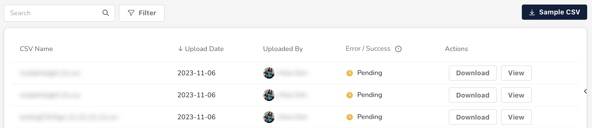

# Configure bids with a CSV

In justtrack, you can configure many bids at once by uploading a CSV containing your new bids. Based on the data in this CSV, we'll automatically configure your bids across your networks and campaigns.

In this guide, you'll learn how to automatically adjust bids with a CSV.

## Navigate to Bid Uploads

In the _Main Menu_, click [**Advertising -> Bid Uploads**](https://dashboard.justtrack.io/advertising/bidding):

<figure><figcaption></figcaption></figure>

Here, you can:&#x20;

* Download our sample CSV, which includes the proper format.
* Upload your CSV.
* View historical bid uploads.

## Download the Sample CSV

If you don't have a CSV already with the [correct format](overview/bid-upload-csv-format.md), click **Sample CSV** to download our pre-formatted CSV file that you can update with your bid data:

<figure><figcaption></figcaption></figure>

Once you've configured your bids in your CSV, you're ready to upload them.

## Upload your CSV

Use the CSV uploader to drag and drop (or browse for) your CSV file. When you do so, we'll [validate your CSV](overview/bid-upload-validation.md) and display a modal with the results:&#x20;

<figure><figcaption></figcaption></figure>

If you have errors, address them and re-upload your CSV. When you've uploaded a valid CSV, click **Set Bids**.

## View Historical Bids

From here, you can see your uploaded CSV in the table, which shows all historical CSV uploads:

<figure><figcaption></figcaption></figure>

You can also click **Download** or **View** to review historical uploads.

## Conclusion

You're done! You've uploaded bid configuration in bulk using the CSV uploader. If you'd prefer to upload bids programatically, check out our [bid upload API](http://127.0.0.1:5000/s/hrcsPPQosGhAkTL0m2NJ/management-api/bid-upload).

If you only need to update one bid at a time, you can still use the CSV uploader. But you can also [adjust bids manually](adjust-bids-manually.md).
