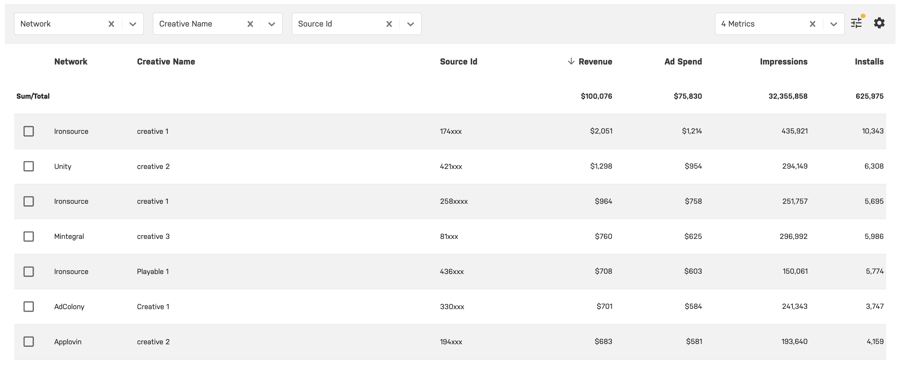

# Overview

One of justtrack’s most valuable features is the granularity of information that is available. We provide cost and revenue data on all dimensions. This includes campaign, sourceId, creative, user.


[cost-integration.md](cost-integration.md)



[user-ad-level-revenue](../../user-ad-level-revenue/user-ad-level-revenue/)

