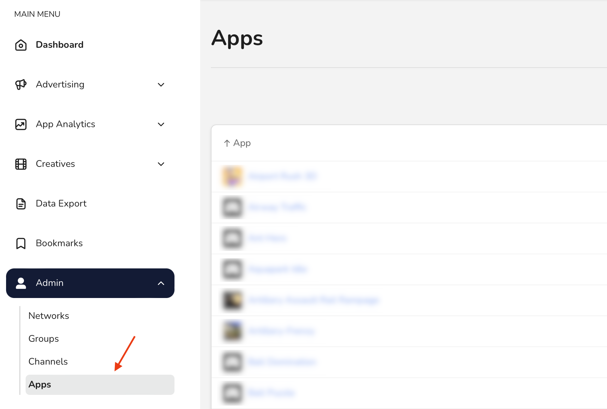

# Manage existing goals

In this guide, you'll learn how to edit and delete existing goals for your application. You may need to edit goals to:

* Update the conditions under which they are triggered
* Update the frequency at which they are triggered

Because each application can only have 25 goals, you may have to delete a goal to reclaim some space for others.

## Before you begin

Only **admins** and **managers** can edit and delete goals. So, to complete the steps in this guide, you must first be an admin or manager for your company.


Learn more about user roles in [User Roles and Permissions](../user-management/user-roles-and-permissions.md).


## Navigate to app goals

In the _Main Menu_, click [**Admin -> Apps**](https://dashboard.justtrack.io/admin/apps):

<figure><figcaption>
Navigate to Apps
</figcaption></figure>

Then, select an app. This opens the _App Hub_ where you can see or edit details about your app.

On the _Goals_ card, click **See Full List**:

<figure><figcaption></figcaption></figure>

This opens the _Goals_ page. Here, you can manage all your existing goals with the **Action** menu:

<figure><figcaption>
Action Menu
</figcaption></figure>

## Edit a goal

Open the **Action** menu for the goal, and click **Edit**. This opens the same Goal Wizard you use to create a goal. Refer to [that guide](create-a-goal.md#define-the-goal-event) for details on every step.


There is one major difference between creating a goal and editing a goal: **you can't edit the name or event after you create the goal.** So, everything on the _Define Goal Event_ page is uneditable.


## Delete a goal


**Warning: deleting a goal has destructive side-effects!**

The following resources are dependent on goals:

**Postbacks**\
We will delete all postbacks based on the goal. This means we will stop sending data to the network when users meet the goal conditions.

**Tracking URLs**

You will no longer be able to create tracking URLs with this goal. Tracking URLs that you've already created with this goal will still continue to function.

\
**Campaigns**

We will remove the goal from all campaigns that use it. We will also stop automatically creating campaigns with this goal. Instead, if a tracking URL uses this goal, we will create the campaign without a goal.

**Statistics**

You will no longer be able to filter statistics by this goal.


Open the **Action** menu for the goal, and click **Delete**.

The goal and all associated resources are deleted from the justtrack user interface. However, you can still access them in S3 or from our public API.
