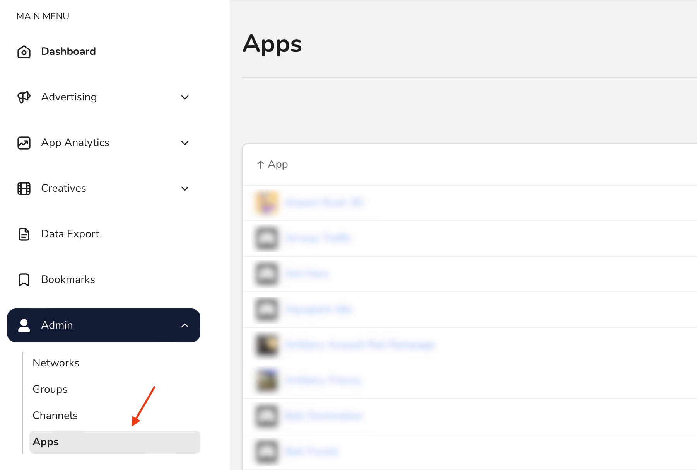

# Manage ad network attributes

In this guide, you'll learn to view and edit attributes, such as keys, tokens, and IDs for your connected ad networks.

## Before you begin

Any **Member, Manager,** or **Admin** in your organization can view network attributes. Only **Admins** and **Managers**, however, can edit them. So, to complete the steps in this guide, make sure you have the correct role.


Learn more about the user roles in [User roles and permissions](../user-management/user-roles-and-permissions.md).


Network connections, and therefore network attributes, are configured per app. So, the first thing to do is navigate to network attributes in the app page.

## Navigate to ad network attributes

In the _Main Menu_, click [**Admin -> Apps**](https://dashboard.justtrack.io/admin/apps):

<figure><figcaption>
Navigate to Apps
</figcaption></figure>

Then, select an app. This opens the _App Hub_ where you can see or edit details about your app.

On the _Advertisement_ card, click **Manage Integration**:

<figure><figcaption>
Manage Integration
</figcaption></figure>

From here, you can view and edit your network attributes in the following sections:

* **Attribution Configurations:** Configure attributes related to network attribution for your connected networks.
* **Network Attributes:** Configure general attributes related to your connected networks.
* **Postback Configurations:** Configure attributes related to postbacks for your connected networks.

To update these attributes:

1. Click **Edit** and make your changes.
2. Click **Save** to save your changes.
