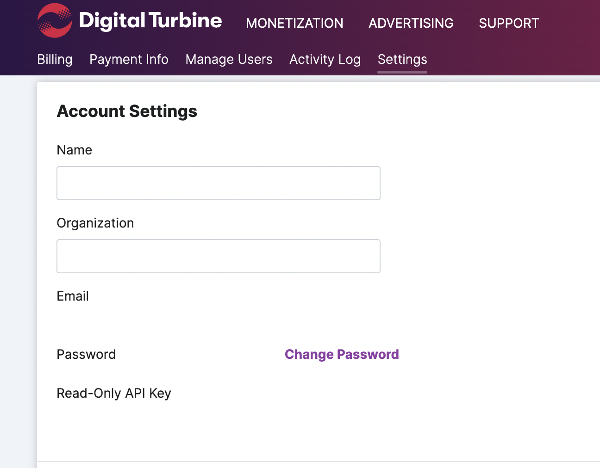

# AdColony / Digital Turbine

AdColony / Digital Turbine is a video ad network. When you set up AdColony as an ad network for justtrack, the following configuration will already be automatically set up:

* Tracking links and the URL placeholders
* Postbacks
* SKAd network id

Justtrack also supports the following UA automation and optimization features, which need to be set up individually:

* Cost Integration
* Bid Management

### Cost Integration, Bid Management

Please provide the following values from AdColony / Digital Turbine dashboard depending on the services that you would like to use:

* `username` (used for bid management)
* `password` (used for bid management)
* `Read only API Key` (used for cost integration)

You can find these credentials in the Settings in the dashboard.

<figure><figcaption>
AdColony / Digital Turbine account settings page
</figcaption></figure>

### Postbacks

Please insert your `Postback API Key` in justtrack.
