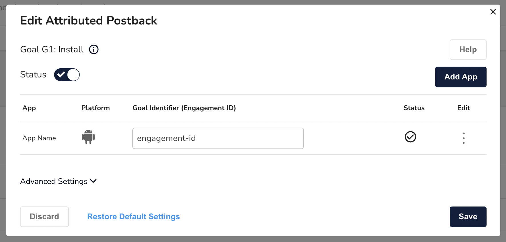

# Tapjoy

When you set up Tapjoy as an ad network for justtrack, the following configuration will already be automatically set up:

* Tracking links and the URL placeholders
* Postbacks
* SKAd network id

Justtrack also supports the following UA automation and optimization features, which need to be set up individually:

* Cost Integration
* Bid Management

### Campaign Setup

To set up a campaign, first create an Account with Tapjoy. Tapjoy is a managed network, so campaign creation will run through an Account Manager.


Tapjoy supports two types of campaigns:

* **single CPE campaigns**: just one event is postbacked. Additionally, the install can be postbacked as well.
* **Multirewards campaigns**: multiple events are postbacked.


The following steps need to be taken to create a campaign:

1. Make sure all goals are created on justtrack. Goals only need to be setup once per account, so unless you want to postback on a new type of event, this should already be done
2. Inform Tapjoy about new campaign details. This requires the exact event name(s) that is postbacked upon. You can get these names from the goals page in justtrack
3. Tapjoy provides the correct engagement\_id per event. This needs to be entered on your Tapjoy network page for the correct goal / postback:

<figure><figcaption><p>Goal / Postback setting with specific engagement id</p></figcaption></figure>

Now justtrack will send the correct id on the postback. The campaign will be [created automatically](broken-reference) in justtrack once we receive the first click / view.

#### Default tracking link template


```http
https://tracking.justtrack.io/click?appBundleId=online.moneyrawr.app&network=219_tapjoy&sourceCampaignId={{MANUALLY-INSERTED-BY-TJ-AM}}&sourceCampaignName=TAPJOY_CAMPAIGN_NAME&platform=android&clickId=TAPJOY_TJCID&sourceId=TAPJOY_GENERIC_SOURCE&adSetId=TAPJOY_OFFER_ID&creativeName=TAPJOY_CREATIVE_NAME&creativeId=TAPJOY_CREATIVE_ID&mobileId=TAPJOY_RESTORED_RAW_ADVERTISING_ID&ip=TAPJOY_DEVICE_CLICK_IP&country=TAPJOY_COUNTRY&osVersion=TAPJOY_DEVICE_OS_VERSION 
```


Additional tracking parameters can be requested by Tapjoy:

* sourceBundleId
* sourceName

#### Default attributed postback template


```http
https://api.tapjoy.com/v3/tpat_app_events?tracker_partner_id=justtrack&app_id={tapjoyEngagementId}&advertising_id={mobileId}&tjcid={clickId}&event_name={goalName}&tapjoy_attributed=1
```



Tapjoy requires that non-attributed postbacks are sent as well. This is automatically configured by justtrack already.


### Cost Integration

Justtrack is integrated with Tapjoy's [GraphQL Reporting API](https://dev.tapjoy.com/en/graphql-api/Quickstart) for cost data. This API requires an authentication via an API Key.

Please enter the `Marketing API Key` into the justtrack Tapjoy network page.

Follow these steps to retrieve the key from Tapjoy:

1. navigate to your Account settings (top right corner, click on `Account`)
2. click on `Reporting API` (right side of the `Account Details` window)
3. Copy the `Marketing API Key` and paste it into justtrack's credentials page for Tapjoy


Pasting the key into justtrack is enough. Justtrack will take care of getting an access token for you as described in the Tapjoy documentation.

