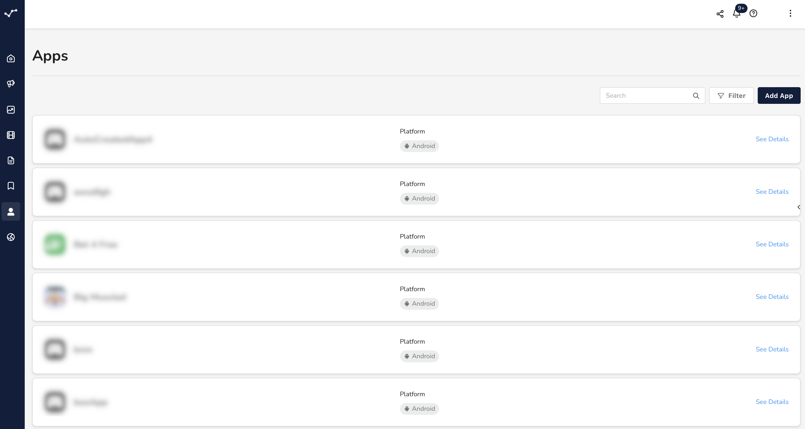

# Overview

**Apps** are the subject and foundation of app marketing and are, therefore, one of the most important resources for you to manage in justtrack. When you've connected your app, you can do things like:

* Manage ad and monetization partners
* Monitor your SDK integrations
* Track your goals
* View app-related statistics
* Run campaigns

<figure><figcaption>
Apps List
</figcaption></figure>

In the _App Management_ section of the justtrack platform, you can access:

* A list of your [connected apps](apps-list.md)
* A central "[app hub](app-hub.md)" for each of those apps
