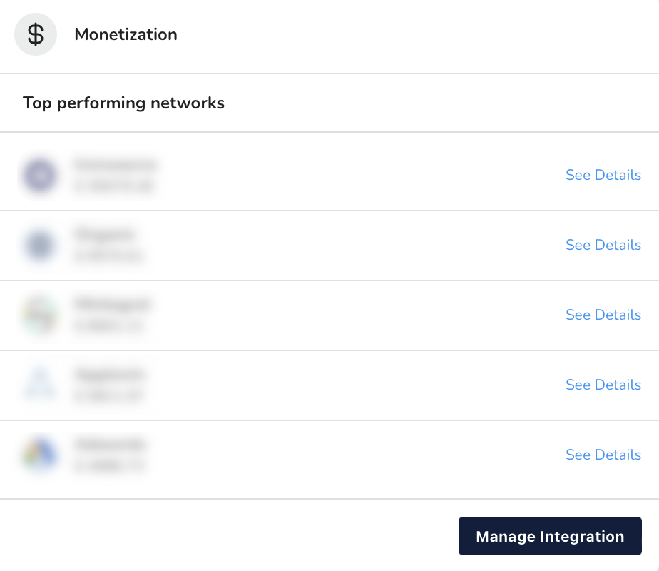
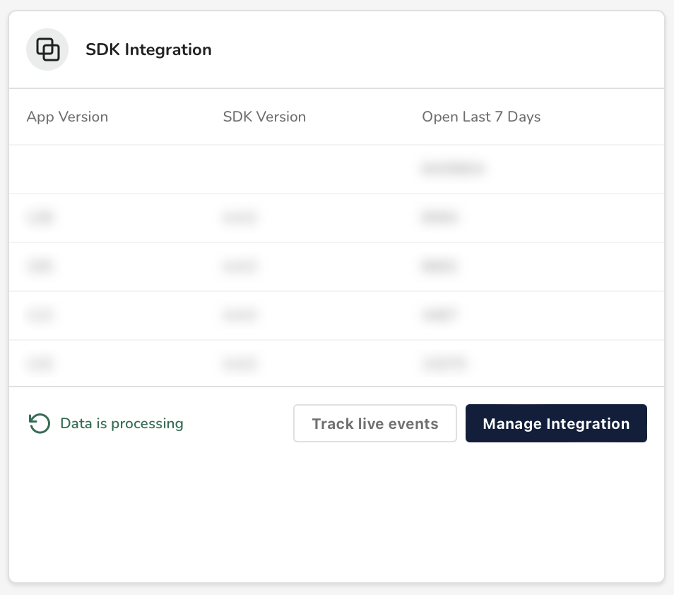

# App hub

In the **app hub**, you'll find all sorts of information about your application, from app details to connected partners and more. This information is organized into the following sections:

### Sidebar

<figure><figcaption>
App Hub Sidebar
</figcaption></figure>

Here, you'll find and edit general information about your app. This incudes the app icon, name, and more.

### Advertising

<figure><figcaption>
Advertising Partners
</figcaption></figure>

Here, you'll find a table of ad partners connected to your app. These are ordered by the amount of installs your app acquired through the partner over the last 24 hours.

Additionally, if you click **Manage Integration**, you can do things like:

* Configure your app's network attributes and attribution values
* View the full list of ad partners connected with your app
* Configure values for your networks' postbacks


Read our [guide](../../../network-management/manage-network-attributes.md) to learn more about managing ad network attributes.


### Monetization

<figure><figcaption>
App Monetization
</figcaption></figure>

Here, you'll find a table of monetization partners. These are ordered by the amount of money generated by partner over the last 24 hours.

Additionally, if you click **Manage Integration**, you can do things like:

* View the full list of monetization partners connected with your app
* Configure existing partners' revenue import values and purchase verification credentials


Read our [guide](../../network-management/manage-monetization-network-attributes.md) to learn more about managing monetization network attributes.


### SDK Integration

<figure><figcaption>
SDK Integration
</figcaption></figure>

Here, you'll find a table that correlates versions of your app to versions of the justtrack SDK running on your app. These are ordered by the amount of users who used that app version in the past week.


**Technical Detail:** The SDK Integration table data reflects the number of times users have opened each version of your app. This is captured with `jt_app_open` [user events](http://127.0.0.1:5000/s/CSwomFswqKEitapGh0xs/readme/predefined-events).


Additionally, if you click **Manage Integration**, you can do things like:

* Look up your justtrack token and retargeting deeplink
* Choose your attribution provider

### Goals

<figure><figcaption>
App Goals
</figcaption></figure>

Here, you'll find a table of app goals. These are ordered from most-frequently-triggered to least-frequently-triggered in the past 7 days.

Additionally, if you click **See Full List**, you can do things like:

* View the full list of app goals.
* Add new goals.
* Edit or delete existing goals.

Read our guides to learn more about how to:

* [Create a goal](../../../goal-management/create-a-goal.md)
* [Manage existing goals](../../../goal-management/manage-existing-goals.md)
