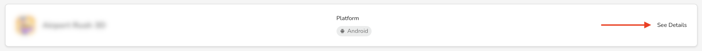

# Apps list

With the _Apps_ list, you can review all the apps connected to your organization:

<figure><figcaption>
Apps List
</figcaption></figure>

In the list of apps, you can see some details, including:

* The app's name
* The app's platform

If you want to see more details about the app, click **See Details** next to any application:

<figure><figcaption>
See Details
</figcaption></figure>
