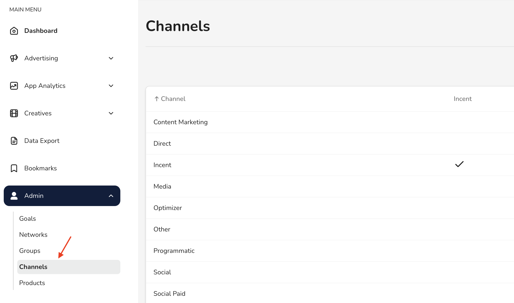

# Manage your channels

In this guide, you'll learn how to:

* Go to your channels list
* Create and edit channels

With channels, you can organize your campaigns and your campaign data.

## Go to your channels list

In the _Main Menu_, click **Admin ->** [**Channels**](https://dashboard.justtrack.io/admin/channels):

<figure><figcaption>
Channels
</figcaption></figure>

## Create a channel

1. From the channels list, click **Create Channel.**
2. Update the [channel details](manage-your-channels.md#channel-details).
3. Click **Create**.

## Edit a channel

1. From the channels list, click **Edit** on the channel you want to edit.
2. Update the [channel details](manage-your-channels.md#channel-details).
3. Click **Save**.

## Channel details

Every channel has the following attributes:

| Attribute    | Description                                |
| ------------ | ------------------------------------------ |
| Channel Name | The name of the channel                    |
| Incent       | Whether or not the channel is incentivized |
