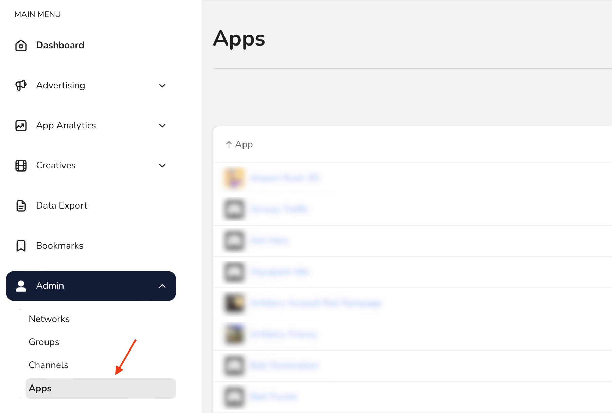
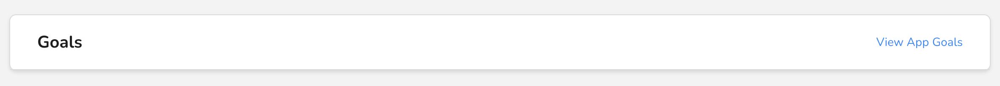
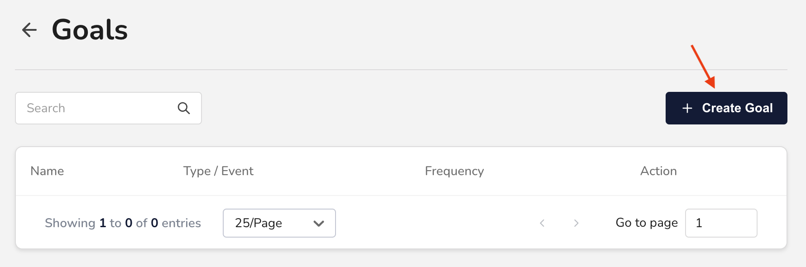
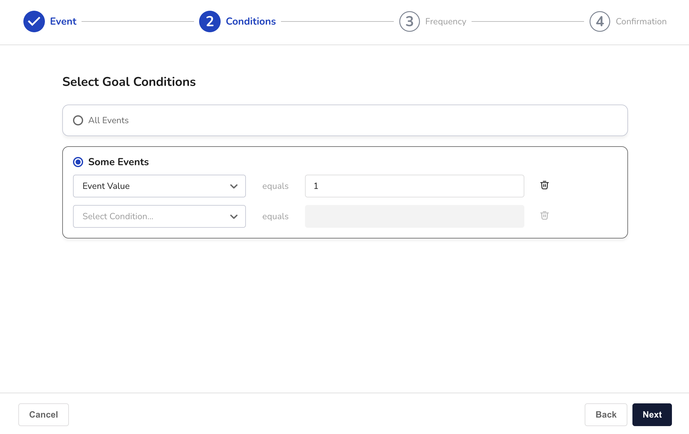

# Create a goal

In this guide, you'll learn how to create a new goal for your application. Among other things, this lets you:

* Trigger postbacks
* Attribute user behaviors

## Before you begin

Only **admins** and **managers** can create and edit goals. So, to complete the steps in this guide, you must first be an admin or manager for your company.


Learn more about user roles in [User Roles and Permissions](../user-management/user-roles-and-permissions.md).


You can only create 25 goals per application, so if you've already reached that limit, you won't be able to follow this guide.

## Create a goal

In the _Main Menu_, click [**Admin -> Apps**](https://dashboard.justtrack.io/admin/apps):

<figure><figcaption>
Navigate to Apps
</figcaption></figure>

Then, select an app. This opens the _App_ page where you can see or edit details about your app.&#x20;

Scroll down on the _App_ page, and click **View App Goals**:

<figure><figcaption>
View App Goals
</figcaption></figure>

This opens the _Goals_ page. Here, you can see all your existing app goals and create new ones.

Click **Create Goal:**

<figure><figcaption>
Create Goal
</figcaption></figure>

This opens the _Goal Wizard_, which walks you through the steps of creating a new goal for your app.

## Define the goal event

Goals are based on events. When this event happens under certain conditions and at a certain frequency, the goal is triggered. Here, you define the name of the goal and the event on which it is based:

<figure><figcaption>
Define Goal Event
</figcaption></figure>

First, type the name of your goal in the _Goal Name_ field.


Your goal name must use only letters, numbers, and underscores.


As you type, the field also searches for existing goals you might want to reuse. You can either:

* Choose an existing goal from the search results.
* Choose a new name and create the goal from scratch.

If you choose to reuse an existing goal, the goal event will be automatically chosen for you. If you choose to create a new goal, you'll be able to configure all aspects of the goal, starting with the event:

<figure><figcaption>
Choose an Event
</figcaption></figure>

If your goal is based on an in-app or server-sent event, you'll also need to choose a specific event to use.

When you're finished, click **Next**.

## Select goal conditions

You can configure your goal to be triggered only if the event happens under certain conditions. For example, imagine you have a goal based on the level-completion event. However, you only want to trigger it if the user picks up a collectible before completing the level. This is a **goal condition**.

On the _Conditions_ page, you can choose **All Events**, which means that the goal is triggered any time the event happens. If you want to set a goal condition, choose **Some Events**, instead:

<figure><figcaption>
Conditional Goal
</figcaption></figure>

Here, you'll set a goal condition by choosing some attribute of the event and a value that it needs to equal.


You can add as many conditions here as you need, provided that each event attribute is only used once.


When you're ready to move on, click **Next**.

## Select goal frequency

On the _Frequency_ page, you can choose how frequently the goal is triggered. The two possible values are:

* **Unlimited:** Every time an event happens.
* **Once:** Only one time per user.

If you choose **Once**, you'll have the option to restrict the goal to trigger only for users who are created after the goal is created.

Make a selection, and click **Next**.

## Confirm your goal

On the _Confirmation_ page, you'll review all the details for your goal. If you need to edit any settings for your goal, click **Back**. You can also edit most of these settings later.


**Important:** You cannot change the name of the goal after you create it, so make sure you're happy with the name you've chosen.


## Conclusion

You're done! You've created a goal for your app. Don't forget, you can always update or delete the goal later, if you need to.

With your new goal, you can also:

* Create or activate an associated postback
* Build tracking URLs based on your goal
* Configure campaigns to use it as the campaign goal
