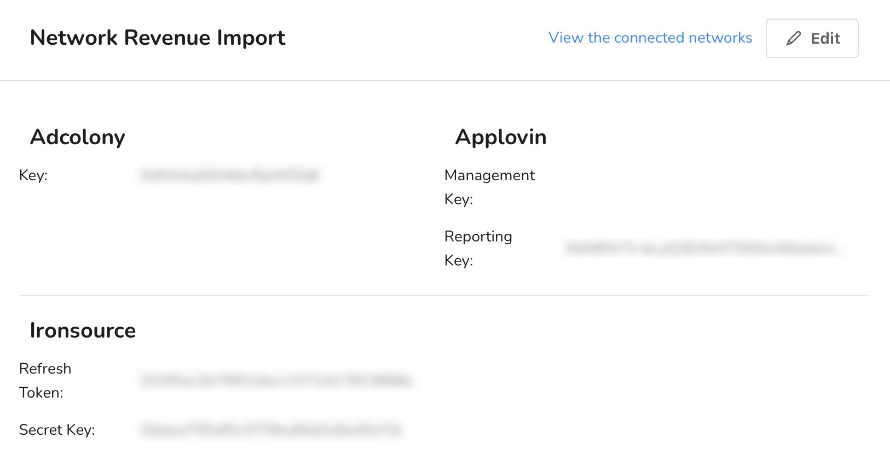

# Manage network attributes

In this guide, you'll learn to view and edit attributes, such as keys, tokens, and IDs for your connected networks.

## Before you begin

Any **Member, Manager,** or **Admin** in your organization can view network attributes. Only **Admins**, however, can edit them. So, to complete the steps in this guide, make sure you have the correct role.


Learn more about the user roles in [User roles and permissions](../user-management/user-roles-and-permissions.md).


Network connections, and therefore network attributes, are configured per app. So, the first thing to do is navigate to network attributes in the app page.

## Navigate to network attributes

In the _Main Menu_, click [**Admin -> Apps**](https://dashboard.justtrack.io/admin/apps):

<figure><figcaption>
Navigate to Apps
</figcaption></figure>

Then, click the app for which you want to view its network attributes. From here, you can view and edit your network attributes in the following sections:

* [Network Revenue Import](manage-network-attributes.md#edit-network-revenue-import-attributes)
* [Network Attribution](manage-network-attributes.md#edit-network-attribution-attributes)

## Edit network revenue import attributes

<figure><figcaption>
Network Revenue Import
</figcaption></figure>

1. Find the **Network Revenue Import** section. Here, you'll see a list of all attributes related to importing revenue from your connected networks.
2. Click **Edit** and make your changes.
3. Click **Save** to save your changes.

## Edit network attribution attributes

<figure><figcaption>
Network Attribution
</figcaption></figure>

1. Find the **Network Attribution** section. Here, you'll see a list of all attributes related to network attribution for your connected networks.
2. Click **Edit** and make your changes.
3. Click **Save** to save your changes.
