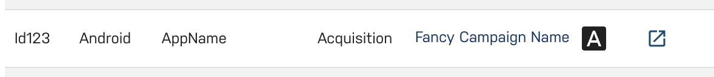

# Campaigns

Justtrack tracks all marketing campaigns so that users have a detailed overview about everything that is relevant.

## Campaign Creation

There are multiple ways how the campaign is created in justtrack:

1. Manual Creation of the campaign in justtrack
2. Automated Creation based on clicks / views

Justtrack supports both campaigns and [ad sets](ad-sets.md). The default layer is a campaign. A campaign can have multiple ad sets, if supported by the network.

### 2. Automated Campaign and Ad Set Creation based on clicks / views

Our vision is that users should be able to manage the whole lifecycle of their advertising campaigns from within our solution. The campaign is needed in justtrack so that users can be attributed and tracked.

The automated creation based on clicks and views is serving as a "fallback" and **will create a campaign or ad set when receiving traffic** (click and view events) for a new campaign or ad set, **that was created on the side of the partner**.

#### Availability

The campaign and ad set creation is only available for partner networks, that can send clicks and views and that have all necessary information on their tracking links:

<table><thead><tr><th>Partner</th><th data-type="checkbox">Campaign Creation Possible</th><th data-type="checkbox">Ad Set Creation Possible</th></tr></thead><tbody><tr><td>AdColony</td><td>false</td><td>false</td></tr><tr><td>Adjoe</td><td>true</td><td>true</td></tr><tr><td>Applovin</td><td>true</td><td>false</td></tr><tr><td>Digital Turbine</td><td>true</td><td>false</td></tr><tr><td>Facebook</td><td>false</td><td>true</td></tr><tr><td>Fluent</td><td>false</td><td>false</td></tr><tr><td>Ironsource</td><td>true</td><td>false</td></tr><tr><td>Kayzen</td><td>true</td><td>false</td></tr><tr><td>Mintegral</td><td>true</td><td>false</td></tr><tr><td>Mobvista</td><td>false</td><td>false</td></tr><tr><td>Offertoro</td><td>false</td><td>false</td></tr><tr><td>Tapjoy</td><td>true</td><td>true</td></tr><tr><td>TikTok</td><td>false</td><td>true</td></tr><tr><td>Unity</td><td>true</td><td>false</td></tr></tbody></table>


Creation of campaigns and ad sets based on clicks / views is only possible when **justtrack is also used as the attribution provider** for the app in question, as only then the clicks and views will be sent directly to the justtrack endpoint. (One notable exception is [automatic ad set creation for Facebook](ad-sets.md), which also works with Appsflyer attribution)


#### Configuration

Campaign creation takes the necessary information from the click and view events that justtrack received for the campaign. Therefore there is a minimum required set of parameters that a tracking link has to include in order to make creating a campaign or an ad set possible.

| Parameter                            | Description                                                                            |
| ------------------------------------ | -------------------------------------------------------------------------------------- |
| `sourceCampaignId`                   | The ID of the campaign in the partner network                                          |
| `appBundleId`                        | Application ID for Apple iTunes/App Store app, or the package name for Google Play     |
| `platform`                           | Either `android` or `ios`                                                              |
| `country`                            | Country of the user (formatted according to `ISO3166 alpha-2`)                         |
| `bidType`                            | Cost model of the campaign (one of `CPI`, `CPA`, `CPC`, `CPM`, `CPM`, `CPV` or `CPVC`) |
| `adSetId` (only for ad set creation) | The ID of the Ad Set in the partner network                                            |

Please use the tracking link builder in the Networks' Admin page in justtrack to generate the tracking link that you need when configuring a campaign in the partner's dashboard.


Automatically created campaigns will use the country that we receive on the tracking link for networks that do not allow for multiple countries on a campaign. For all other networks, campaigns will be created with **ALL** countries.



When **creating new networks** there is currently **no possibility** for users to enable automatic campaign or ad set creation for them. For requesting new networks to be enabled (if the tracking of the network supports it) please contact the justtrack customer support.


#### Capabilities and Limitations

Campaigns created from clicks / views will be marked with an "A" in the _Campaigns_ Overview, so you can spot them easily:

<figure><figcaption>
Automatically created campaign in the campaign list
</figcaption></figure>

After a campaign or an ad set was created based on the tracking links, justtrack will automatically execute an attribute sync process [for supported networks](user-acquisition-automation.md). That way, missing information like **budget**, **targeting options**, **countries** and **scheduling information** is added.

However, data syncing is not supported by all networks. In these cases, missing information needs to be added manually.

If no campaign or ad set name is specified on the tracking links, it will be generated by justtrack. For ad sets, the generated name will include the ID of the ad set in the partner network, in order to make matching them to the data in the partner software easier.


Be aware that the creation of campaigns or ad sets can take some time, as it will only be possible, once justtrack received click or view events for the campaign in question.

