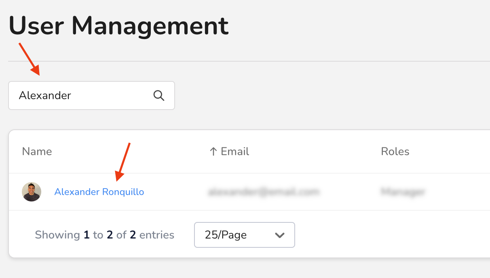
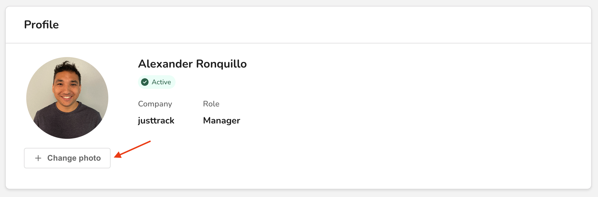
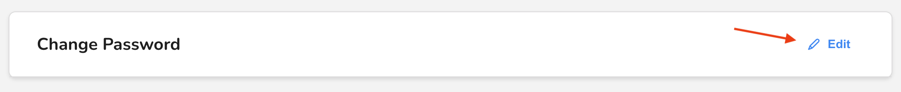

# Change a user's settings

In this guide, you'll learn how to change a user's settings and details. This lets you to update their personal information, grant or revoke permissions, and more.

## Before you begin

Only **Admins** can view and edit users. So, to complete the steps in this guide, you must first be an Admin for your organization.


Learn more about the Admin role in [User roles and permissions](user-roles-and-permissions.md).


## View the user's current settings

In the _Main Menu_, click **Admin ->** [**User Management**](https://dashboard.justtrack.io/admin/managers):

<figure><figcaption>
User Management
</figcaption></figure>

Then, search for the user you're trying to update, and click their name in the table:

<figure><figcaption>
User Search
</figcaption></figure>

This opens the _User Information_ page where you'll find the user's:

* Profile
* Personal Data
* Roles and Permissions
* Password
* Extra Settings

You can change all of this information.

## Change the user's photo

Under the user's photo, click **Change photo**:

<figure><figcaption>
Change Photo
</figcaption></figure>

This opens a file browser where you can select an image to use for the user's profile.

## Change the user's personal data

Under _Personal Data_, click **Edit**:

<figure><figcaption>
Edit Personal Data
</figcaption></figure>

Then, you can update the user's first name, last name, and email.

## Change the user's role

Every user has one of the following Roles:

* Admin
* Manager
* Member
* External


Learn more about these roles in [User roles and permissions](user-roles-and-permissions.md).


Under _Roles and Permissions_, click **Edit** to change the user's role:

<figure><figcaption>
Edit User
</figcaption></figure>

Here, you have the ability to select a new role for the user. When you select a new role, you can see the permissions they'll be granted. You can also read more about them in [User roles and permissions](user-roles-and-permissions.md).

Select a new role for your user and click **Save changes**:

<figure><figcaption>
Save Changes
</figcaption></figure>


If you change your mind, and no longer want to change the user's role, click **Discard**, instead.


## Change the user's password

Under _Change Password_, click **Edit**:

<figure><figcaption>
Change Password
</figcaption></figure>

Next, you'll be asked to provide a new password. It must be a strong password. When you've typed it once, you'll need to type it again to confirm it.

## Activate or deactivate the user

There are multiple ways to activate or deactivate a user. One of those is here on the _User Information_ page. Read [Activate or deactivate a user](change-a-users-settings.md#activate-or-deactivate-the-user) to learn more.

## Conclusion

Now you've learned how to change many attributes of an existing user. If you don't yet have a user, you can [create one](create-a-new-user.md).


If you need help with some part of the process, check out our [troubleshooting suggestions](troubleshoot-common-issues.md).

