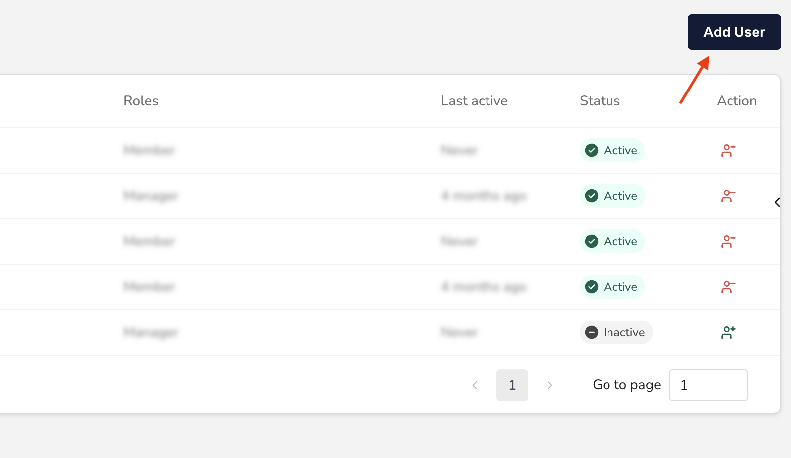

# Create a new user

In this guide, you'll learn how to create a new user for your organization. Among other things, this lets you:

* Assign them a role
* Control their access permissions


There is no limit to the amount of users your organization can have.


## Before you begin

Only **Admins** can view, create, and edit users. So, to complete the steps in this guide, you must first be an Admin for your organization.


Learn more about the Admin role in [User roles and permissions](user-roles-and-permissions.md).


## Create a new user

In the _Main Menu_, click **Admin ->** [**User Management**](https://dashboard.justtrack.io/admin/managers):

<figure><figcaption>
User Management
</figcaption></figure>

Then, click **Add User**:

<figure><figcaption>
Add User
</figcaption></figure>

This opens the _Create User_ modal where you'll input your user's information and select their role. There are two important things to consider here:

* When you create a new user, a random password is automatically generated. Only Admins can change a user's password.
* You'll assign your user to one of four roles: Admin, Manager, Member, and External. Learn more about these roles in [User roles and permissions](user-roles-and-permissions.md).

When you've added all the user's information and selected a role, click **Create**:

<figure><figcaption>
Create User
</figcaption></figure>

This creates the user with the information you entered in the previous step.


Now, you need to provide the generated password to your team member so they can access the account.


## Conclusion

That's it! You created a new user for your organization. You can now see the user's profile on the _User Management_ page.

If you need to, you can manage the user there. For example, you can:

* [Activate or deactivate the User](activate-or-deactivate-a-user.md)
* [Change their Role](change-a-users-settings.md)


If you need help with some part of the process, check out our [troubleshooting suggestions](troubleshoot-common-issues.md).

