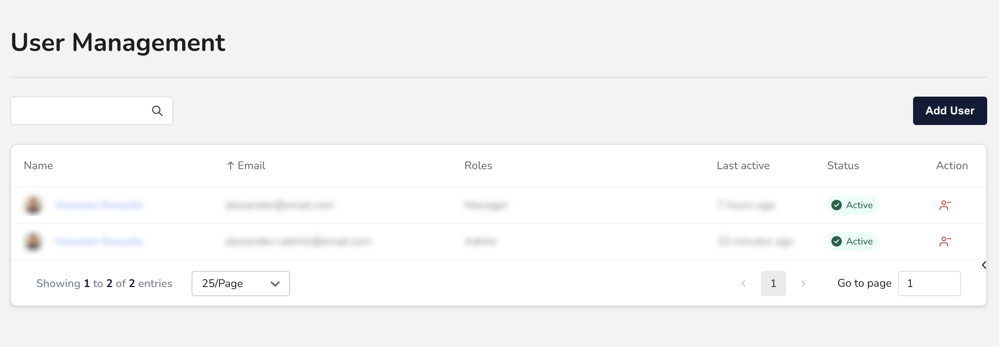

# Overview

<figure><figcaption>
User Management
</figcaption></figure>

As an admin, you have full control over your company's users from the _User Management_ page. Here, you can:

* Search and view your Users
* [Add new Users](create-a-new-user.md)
* Update their information and settings
* [Change their Roles](change-a-users-settings.md)
* [Activate or deactivate their accounts](activate-or-deactivate-a-user.md)


Only Admins can access _User Management_. Learn more in [User Roles and Permissions](user-roles-and-permissions.md).

