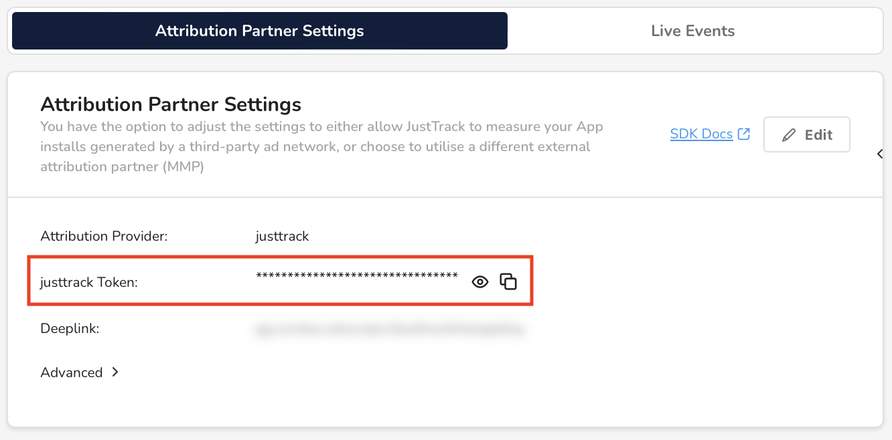

# Find your justtrack token

In this guide, you'll learn how to find the justtrack token for your app. You'll configure your SDK with this token to send data to the correct app in justtrack.

## Before you begin

Only **admins** and **managers** can create and edit apps. So, to complete the steps in this guide, you must first be an admin or manager for your organization.


Learn more about user roles in [User Roles and Permissions](broken-reference).


## Find your justtrack token

In the _Main Menu_, click [**Admin -> Apps**](https://dashboard.justtrack.io/admin/apps)**:**

<figure><figcaption>
Apps
</figcaption></figure>

Then, select an app. This opens the _App Hub_ where you can see or edit details about your app.

On the _SDK Integration_ card, click **Manage Integration**:

<figure><figcaption>
Manage Integration
</figcaption></figure>

Under _Attribution Partner Settings_, you can find and edit attribution information for your app. Included here is your justtrack token, which you can view or copy:

<figure><figcaption>
Justtrack Token
</figcaption></figure>

