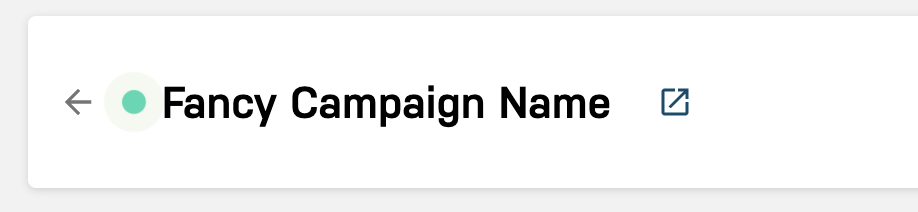
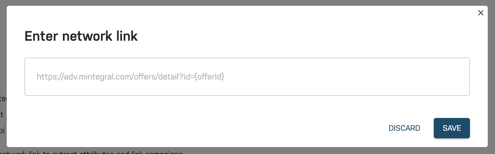

# Campaign Linking

Justtrack campaigns can be linked to partner campaigns so that you can find them more easily. Clicking on the link icon will directly forward you to the campaign page in the partner dashboard.

The link is displayed right next to the campaign name.

#### Automated link extraction

For some networks, the link is extracted automatically:

* Unity
* Mintegral

#### Manual link extraction

For the other networks, you can manually enter the partner campaign URL by clicking on the link icon in the campaign details page.

The expected template is network specific. Please enter the partner campaign URL and click save - the campaigns are now linked.

