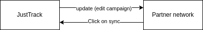

# Campaign Synchronization

Justtrack allows users to edit campaign attributes. These changes will be updated in the partner networks automatically for some networks.

The following attributes can be edited:

* name
* campaign status: live / paused
* countries
* budget
* start + end dates
* targeting options (OS versions, screen density etc.)

#### Supported Partners

<table><thead><tr><th>Partner</th><th data-type="checkbox">Supported</th></tr></thead><tbody><tr><td>Adjoe</td><td>true</td></tr><tr><td>Google Ads</td><td>true</td></tr><tr><td>Unity</td><td>true</td></tr></tbody></table>


The user can adjust campaign attributes either in justtrack or on partner side. For the integrated networks, we suggest to conduct all actions in justtrack as changes are automatically updated in the partner dashboard.

To make sure the campaign attributes are correct in justtrack at all times, a manual sync can be executed.


#### Campaign Update

Whenever attributes or targeting options are changed in justtrack, it will be updated on partner side for the integrated networks as well.

#### Campaign Sync

To update the justtrack campaign details to the newest version, users can execute a campaign sync by clicking on the button in the campaign details page. By doing this, the current campaign details on partner side are synced to justtrack and override the status quo.

After a campaign was created in [justtrack based on clicks / views](campaigns.md), the campaign attributes and targeting options are synced from the partner and updated in justtrack.


We recommend that you conduct all campaign changes in justtrack for the supported networks. If you mix where the changes are done, one change might override correct values accidentally.

