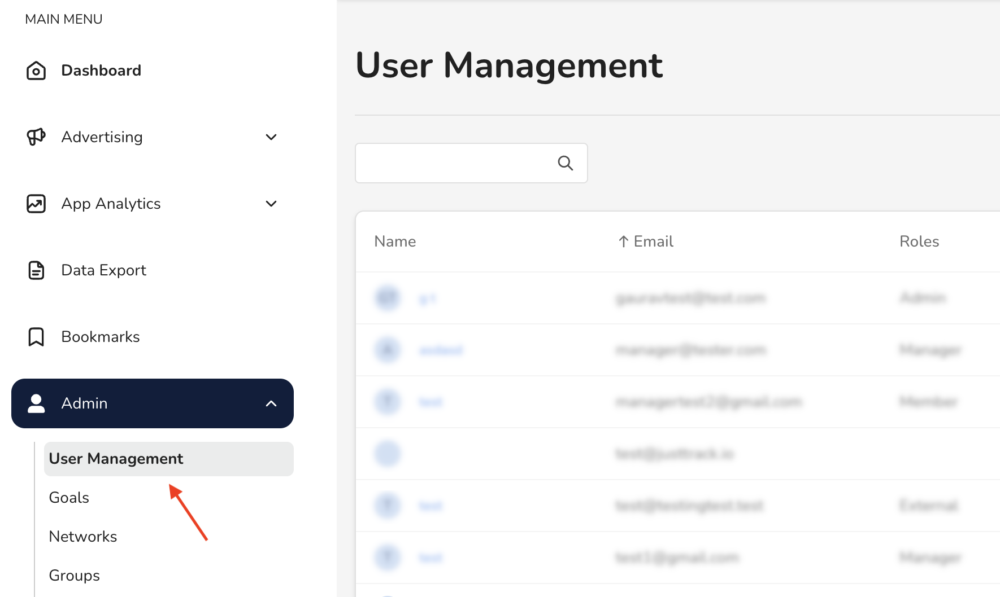
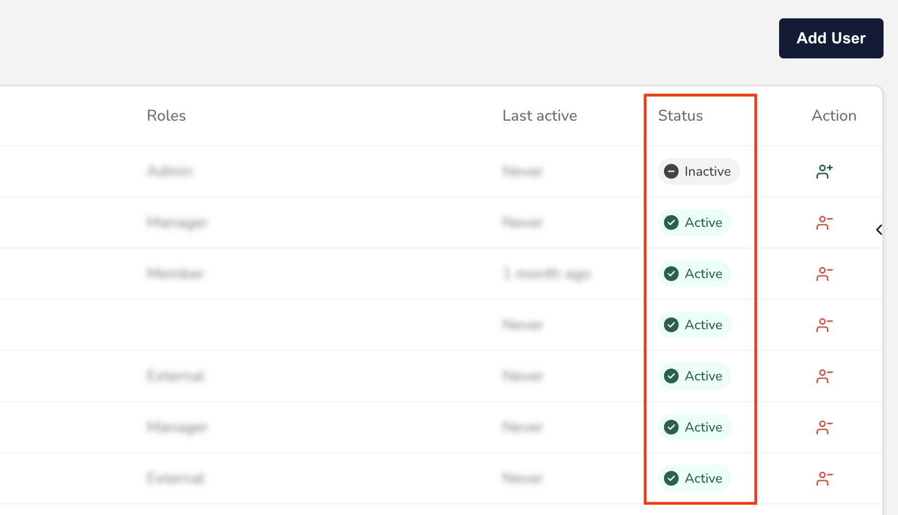
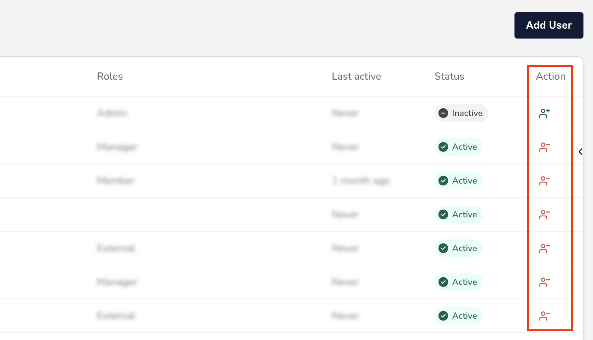
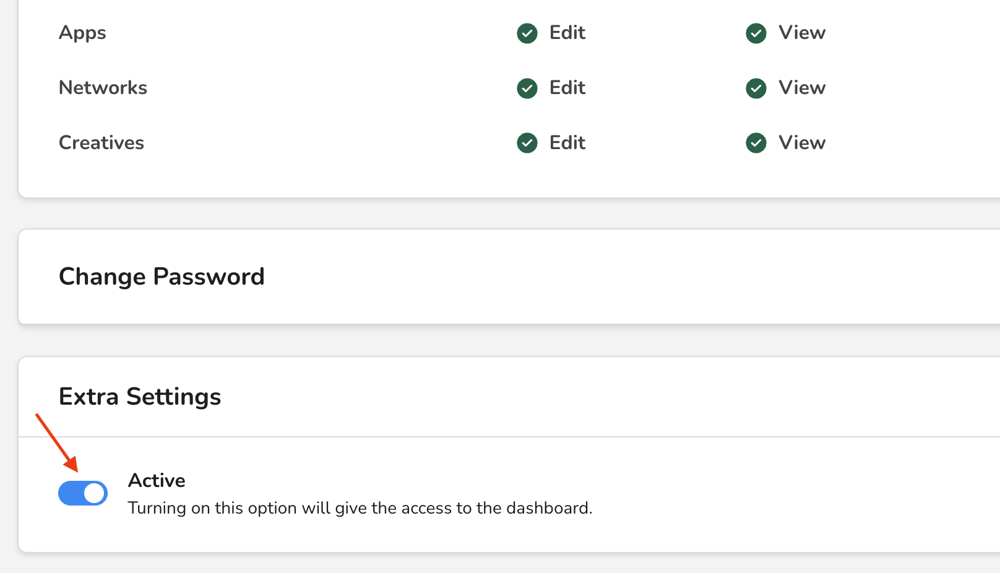

# Activate or deactivate a user

In this guide, you'll learn how to activate or deactivate a user.

An active user is one who can log in to the justtrack platform and who has access according to their role. An inactive user can't log in to justtrack at all.

Both of these statuses can be changed; an active user can be deactivated and an inactive user can be re-activated at any time.


There is no way to delete a user. You can only deactivate them.


## Before you begin

Only **Admins** can view, create, and edit users. So, to complete the steps in this guide, you must first be an Admin for your organization.


Learn more about the Admin role in [User roles and permissions](user-roles-and-permissions.md).


## Activate and deactivate a user

In the _Main Menu_, click **Admin ->** [**User Management**](https://dashboard.justtrack.io/admin/managers):

<figure><figcaption>
User Management
</figcaption></figure>

From here, there are two ways to activate or deactivate a user.

### Use the User Management table

From the _User Management_ view, you can see the user's current status in the table:

<figure><figcaption>
User Status
</figcaption></figure>

Next to the user's current status, there is an _Action_ column. With this column, you can activate or deactivate the user:

<figure><figcaption>
Activate or Deactivate a User
</figcaption></figure>

When you click the icon to activate or deactivate a user, you'll see a modal that asks you to confirm your decision.

### Use the User Information page

On the _User Management_ page, click a user's name to see their information page. You can see the user's current status in the _Profile_ section:

<figure><figcaption>
User Status
</figcaption></figure>

And in the _Extra Settings_ section:

<figure><figcaption>
Extra Settings
</figcaption></figure>

With the toggle in _Extra Settings_, you can activate or deactivate the user. Like in the _User Management_ page, you'll see a modal that asks you to confirm your decision.

## Confirm your decision

However you activate or deactivate the user, their status is instantly changed when you confirm your decision. But don't worry, you can deactivate or reactivate a user at any time.

## Conclusion

You've learned two ways to activate and deactivate a user's account in justtrack.

* From the _User Management_ page
* From the _User Information_ page

If you want to restrict a user's permissions without completely deactivating their account, you can [change their role](change-a-users-settings.md).


If you need help with some part of the process, check out our [troubleshooting suggestions](troubleshoot-common-issues.md).

